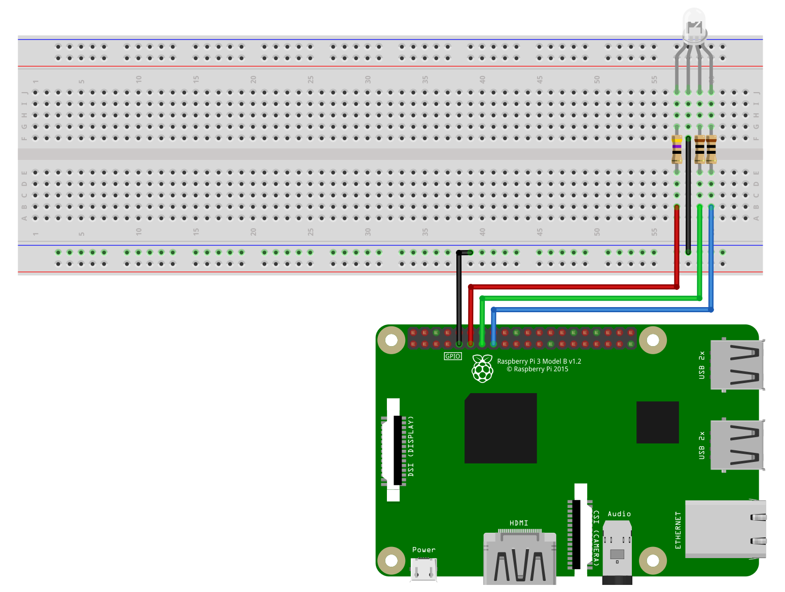
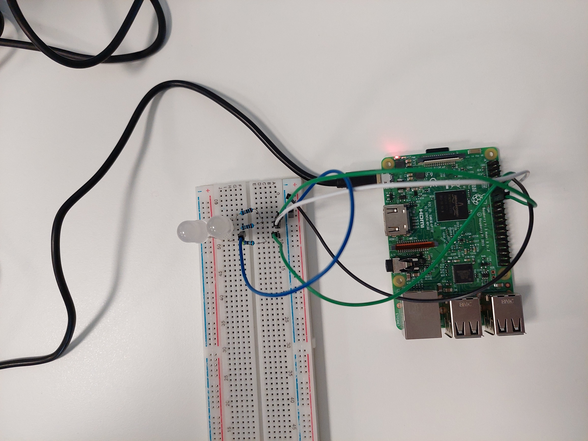

# P2-gpio-ledrgb

This exercise consists on drive a [RGB LED](https://github.com/clases-julio/p2-gpio-ledrgb-dgarciac2021/wiki/RGB-LED) with the [GPIO](https://github.com/clases-julio/p1-introrpi-pwm-dgarciac2021/wiki/GPIO) available on the [Raspberry Pi 3B+](https://github.com/clases-julio/p1-introrpi-pwm-dgarciac2021/wiki/Raspberry-Pi#raspberry-pi-3b). You might want to take a look on the [wiki](https://github.com/clases-julio/p2-gpio-ledrgb-dgarciac2021/wiki), since there is info of everything involved on this project. From the [RGB color model](https://github.com/clases-julio/p2-gpio-ledrgb-dgarciac2021/wiki/RGB) to the [RGB LED](https://github.com/clases-julio/p2-gpio-ledrgb-dgarciac2021/wiki/RGB-LED).

## Circuit Assembly

The assembly is pretty straight-forward, just like [the previous one](https://github.com/clases-julio/p1-introrpi-pwm-dgarciac2021) but repeated three times. However, this time we are using a fixed value of Ω for each color (47Ω for **R**ed and 10Ω for **G**reen and **B**lue)[^1]

This is an schematic made with [Fritzing](https://fritzing.org/):



And this is the real circuit!



## Code

We would like yo highlight some remarkable aspects from our code.

### Dictionary

```python
colors = {"red": 4, "green": 2, "blue": 1, "cyan": 3, "magenta": 5, "yellow": 6, "white": 7, "black": 0}
```

|Color|Deciamal|Binary (RGB)|
|---|---|---|
|Red|4|1 0 0|
|Green|2|0 1 0|
|Blue|1|0 0 1|
|...|...|...|

### Not all bits

```python
        # Only do something if yhe color to represent is not black.
        # Actually when we turn on a color, it is substracted from the previous one.
        # That means that only the bits that match a given color are changed.
        # Same goes for the "on" mode.
        if mode == "off": # Turn off a color means flip its bits!
            if rValue: rValue = not rValue
            else: rValue = GPIO.input(redPin)
            if gValue: gValue = not gValue
            else: gValue = GPIO.input(greenPin)
            if bValue: bValue = not bValue
            else: bValue = GPIO.input(bluePin)

        if mode == "on": # pass = do nothing. This is used since the if statment could not be empty.
            if rValue: pass 
            else: rValue = GPIO.input(redPin)
            if gValue: pass
            else: gValue = GPIO.input(greenPin)
            if bValue: pass
            else: bValue = GPIO.input(bluePin)
```

### Is valid?

```python
def validInput(args):
    if len(args) == 1 and args[0] == "off" or args[0] == "exit": return True
    if len(args) == 2 and args[1] in colors and (args[0] == "on" or args[0] == "off"): return True
    print("Non valid option!")
    return False # Reach this point means that the argument has not passed
    # any filter.
```

## Circuit testing

This is the result! Pretty nice, isn't it?


[^1]: Those resistor values were calculated for approximately 16mA of current for each channel. This resulted to be too bright (Both for our eyes and for the camera) so in the real circuit **two** leds are used simultaneously in order to half that current between and therefore make them dimmer.
